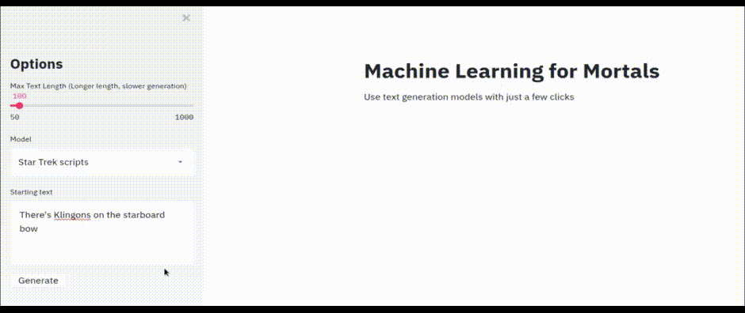

# Easy Text Generator

AI-powered text generation for mere mortals.

[](https://www.python.org/)



## What is it?

An app that runs in your web browser and uses a nice GUI interface to generate text from pre-trained machine learning models like GPT-2. It doesn't support training models at the moment.

## Advanced options

* `top_k` and `top_p` are explained well [here](https://github.com/VBPXKSMI/Open-CYOAI-Project/wiki/A-quick-explanation-on-what-is-top_k,-temp-and-top_p)
* For `model from transformers`, just copy the `foo/bar` phrase from any model in https://huggingface.co/models. Not everything will work, but anything using GPT or text generation in general (i.e. not sentiment analysis, etc) should work okay.

## Can I See some Examples?

### General text (distilgpt2)

Starting text: `There once was an ugly duckling`

```
There once was an ugly duckling in the woods. It didn't hurt. The little little
yellow duckling was just so well dressed, and looked like so many of us. She
didn't really know how it looked, or why it looked. Her face was completely
lost, but now there is a lot more. I don't know what my mind was about this
thing. But she just felt sad. And when I saw her that day the eyes were staring
at her again. It was horrible. I saw it's ugly little duckling, or whatever it
is, but it always looked ugly. And I just knew that once again, this was not
something she liked to see. The little green duckling was just so well dressed.
But it looked like that too. There was nothing I could do. I was just really
```

### General text (GPT-2)

Starting text: `It is a truth universally acknowledged`

```
It is a truth universally acknowledged that any single person's life will change
when he or she becomes a parent, even if he or she becomes a parent on his or
her own. To put it bluntly, that person's life will change for the better if he
or she gets a baby and the child is adopted.  When I talk to children in
orphanages or on the streets that all I hear is talk of wanting to adopt and
growing up being a "good baby" or that children are not in trouble when they
don't get adopted because "the community would always give them a chance." I
don't want to hear that when they ask, "What did you know or don't know about
adoption?" 
```

### Star Trek scripts

Starting text: `One to beam up Mr Scott`

```
[Transporter room]

SCOTT: Mister Data. 
DATA: We are still at three million kilometres. 
SCOTT: Mister Data, you won't have much time. Beam away. 
DATA: We will be gone in two minutes. 
SCOTT: Mister Data, you just won't do it. You have to get back into
here, Mister Data. 
DATA: Sir, I wish to
```

## How Do I Use it?

### Precautions

* Machine learning needs a LOT of RAM. I highly recommend 16gb or more, or enabling a swap partition if you're on Linux. Otherwise your machine may just lock up during install or running the program (it happened to me plenty).
* The process may take a while. The video above is highly edited. It really took about 3 minutes to generate that text on my laptop.

### Install

```bash
git clone git@github.com:alexcg1/easy_text_generator
cd easy_text_generator
pip install -r requirements.txt
```

### Run

In the same directory as above

```bash
streamlit app.py
```

It opens a tab in your web browser where you can choose the model you want and generate text.

### Thanks to:

* [Script Buddy v2](https://github.com/cdpierse/script_buddy_v2) - code adapted from here
* [Huggingface](https://huggingface.co/models) - a huge list of models for working with text
* [Manu Romero](https://twitter.com/mrm8488) for help creating recipes language model
